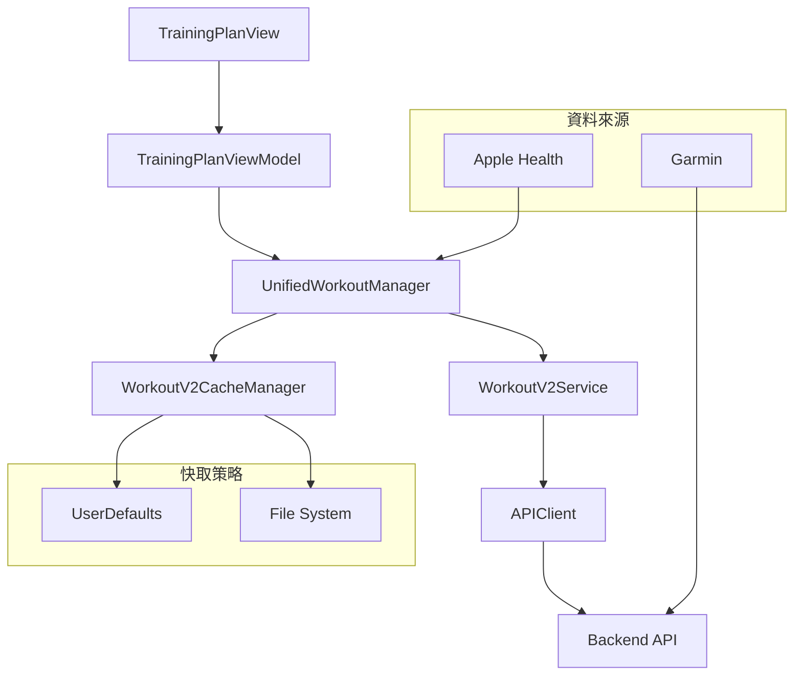
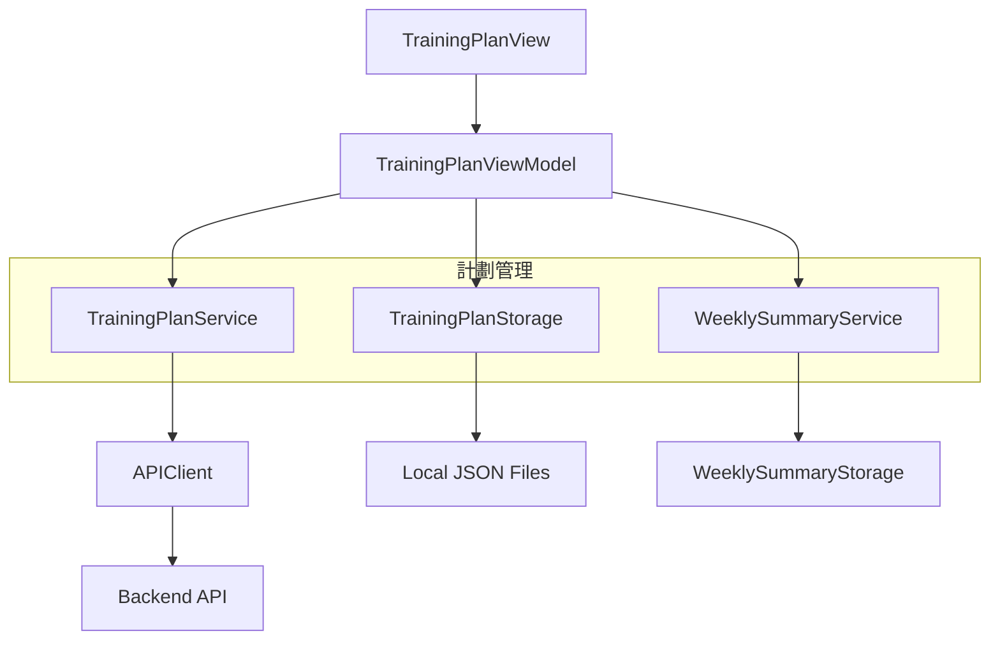
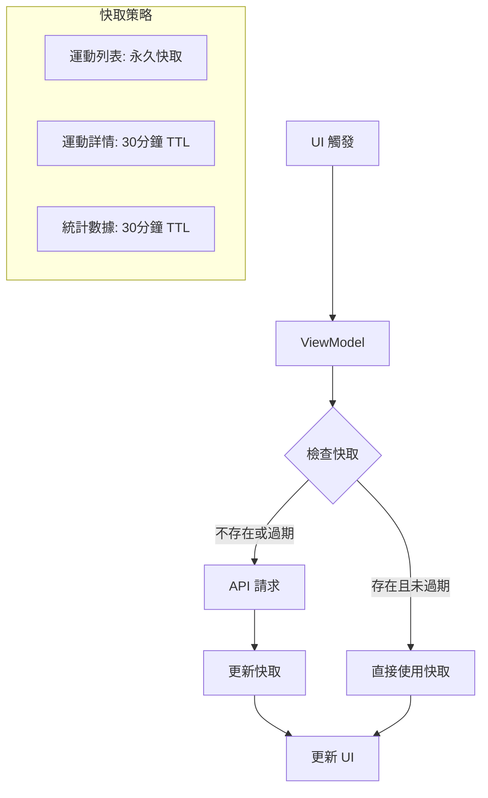

# 資料流程架構分析

## 1. 整體架構概覽

Havital iOS 應用採用多層架構，實現了清晰的資料流向和職責分離：

```
┌─────────────────────────────────────────────────────────────────┐
│                        UI Layer                                 │
├─────────────────────────────────────────────────────────────────┤
│  TrainingPlanView → TrainingPlanViewModel                      │
│  WorkoutDetailView → WorkoutDetailViewModelV2                  │
│  TrainingRecordView → TrainingRecordViewModel                  │
├─────────────────────────────────────────────────────────────────┤
│                    Business Logic Layer                         │
├─────────────────────────────────────────────────────────────────┤
│  UnifiedWorkoutManager (統一資料管理)                           │
│  TrainingIntensityManager (訓練強度管理)                       │
├─────────────────────────────────────────────────────────────────┤
│                    Service Layer                                │
├─────────────────────────────────────────────────────────────────┤
│  WorkoutV2Service   │  TrainingPlanService                     │
│  WeeklySummaryService │ AuthenticationService                  │
├─────────────────────────────────────────────────────────────────┤
│                    Cache Layer                                  │
├─────────────────────────────────────────────────────────────────┤
│  WorkoutV2CacheManager  │  TrainingPlanStorage                 │
│  WeeklySummaryStorage   │  TargetStorage                       │
├─────────────────────────────────────────────────────────────────┤
│                    Network Layer                                │
├─────────────────────────────────────────────────────────────────┤
│  APIClient → Backend API                                       │
└─────────────────────────────────────────────────────────────────┘
```

## 2. 核心組件分析

### 2.1 API層 (APIClient)

**職責**: 統一網路請求管理
- 基於 `Actor` 實現，確保線程安全
- 自動處理 Firebase ID Token 認證
- 統一錯誤處理機制
- 支援請求重試和網路狀態監控

**關鍵特性**:
```swift
actor APIClient {
    func request<T: Decodable>(endpoint: Endpoint) async throws -> T
    private func handleAuthentication() -> String?
    private func handleErrorResponse(_ response: HTTPURLResponse) -> APIError
}
```

### 2.2 快取層 (Cache Layer)

#### WorkoutV2CacheManager
- **運動列表快取**: UserDefaults，永久快取 (最多1000筆)
- **運動詳情快取**: 檔案系統，30分鐘 TTL
- **統計數據快取**: UserDefaults，30分鐘 TTL
- **背景清理**: 自動清理過期檔案

```swift
// 快取策略配置
private let maxWorkoutListSize = 1000
private let workoutDetailTTL: TimeInterval = 30 * 60  // 30分鐘
private let statsTTL: TimeInterval = 30 * 60         // 30分鐘
```

#### TrainingPlanStorage
- **週計劃快取**: 本地 JSON 檔案存儲
- **智能快取更新**: 支援 skipCache 參數
- **版本管理**: 自動處理計劃版本更新

### 2.3 服務層 (Service Layer)

#### WorkoutV2Service
- **CRUD 操作**: 運動資料的完整生命週期管理
- **分頁查詢**: 支援 limit 和 offset 參數
- **條件篩選**: 基於時間範圍和類型的篩選
- **Garmin 整合**: 特殊的 Garmin 資料同步處理

#### TrainingPlanService
- **計劃管理**: 週計劃的生成、查詢、更新
- **404 處理**: 特殊的 NotFound 錯誤處理
- **週計劃生成**: 基於 AI 的個人化課表生成

### 2.4 業務邏輯層 (Business Logic Layer)

#### UnifiedWorkoutManager
- **統一資料管理**: 整合 Apple Health 和 Garmin 資料
- **任務管理**: 智能的任務取消和重試機制
- **背景更新**: 不阻塞 UI 的資料更新
- **資料來源切換**: 支援多種資料來源

```swift
class UnifiedWorkoutManager {
    private var currentLoadTask: Task<Void, Never>?
    
    func loadWorkouts() async {
        // 智能任務管理，避免重複載入
        if let existingTask = currentLoadTask {
            await existingTask.value
            return
        }
        
        currentLoadTask = Task {
            await performLoadWorkouts()
        }
    }
}
```

#### TrainingIntensityManager
- **心率區間計算**: 基於 HRR 的強度區間劃分
- **實時分析**: 即時的訓練強度監控
- **歷史統計**: 長期的訓練強度趨勢分析

### 2.5 視圖模型層 (ViewModel Layer)

#### TrainingPlanViewModel
- **複雜狀態管理**: 使用 `PlanStatus` 枚舉管理 UI 狀態
- **資料聚合**: 整合多個資料來源的資訊
- **智能快取**: 實現 TTL 和手動刷新策略
- **任務管理**: 防止並發衝突的任務協調

```swift
enum PlanStatus {
    case loading
    case noPlan
    case ready(WeeklyPlan)
    case completed
    case error(Error)
}

class TrainingPlanViewModel {
    @Published var planStatus: PlanStatus = .loading
    private var refreshTask: Task<Void, Never>?
    
    func refreshWeeklyPlan(isManualRefresh: Bool = false) async {
        refreshTask?.cancel()
        refreshTask = Task {
            await performRefreshWeeklyPlan(isManualRefresh: isManualRefresh)
        }
    }
}
```

#### WorkoutDetailViewModelV2
- **效能優化**: 資料降採樣技術 (最多500個點)
- **快取優先**: 30分鐘 TTL 的詳情快取
- **任務取消**: 正確的任務生命週期管理
- **圖表資料**: 時間序列資料的轉換和處理

## 3. 資料流程圖

### 3.1 運動資料流程



### 3.2 訓練計劃流程



### 3.3 快取更新流程



## 4. 關鍵資料流程

### 4.1 應用啟動流程

1. **初始化階段**
   - `HavitalApp` 啟動，初始化全局服務
   - `AuthenticationService` 檢查登入狀態
   - `UnifiedWorkoutManager` 初始化資料來源

2. **資料載入階段**
   - `TrainingPlanViewModel.loadAllInitialData()` 載入初始資料
   - 優先從快取載入，背景更新資料
   - 並行載入訓練計劃、運動記錄、統計資料

3. **UI 渲染階段**
   - 基於 `PlanStatus` 決定顯示的視圖
   - 響應式 UI 更新機制
   - 平滑的載入動畫和錯誤處理

### 4.2 下拉刷新流程

1. **觸發刷新**
   - 用戶下拉觸發 `refreshWeeklyPlan(isManualRefresh: true)`
   - 取消現有任務，創建新的刷新任務

2. **資料更新**
   - 強制從 API 獲取最新資料
   - 跳過所有快取，直接更新後端資料
   - 並行更新運動記錄和訓練計劃

3. **快取更新**
   - 更新本地快取
   - 清理過期快取檔案
   - 同步快取時間戳

### 4.3 運動詳情載入流程

1. **快取檢查**
   - 檢查 30分鐘 TTL 的詳情快取
   - 如果快取有效，直接使用快取資料

2. **API 請求**
   - 如果快取無效，從 API 獲取詳情
   - 處理時間序列資料轉換

3. **效能優化**
   - 資料降採樣 (最多500個點)
   - 背景線程處理資料轉換
   - 即時更新 UI

## 5. 潛在問題與建議

### 5.1 高風險問題

#### 1. 快取一致性問題
**問題**: 多個快取系統可能導致資料不一致
```swift
// 現狀：分散的快取管理
WorkoutV2CacheManager.shared.clearCache()
TrainingPlanStorage.clearCache()
WeeklySummaryStorage.clearCache()
```

**建議**: 實現統一的快取協調器
```swift
protocol CacheCoordinator {
    func invalidateAll()
    func invalidateRelated(to dataType: DataType)
    func syncCacheStates()
}
```

#### 2. 任務管理複雜性
**問題**: 複雜的任務取消邏輯可能導致競態條件

**建議**: 使用 Actor 模式簡化任務管理
```swift
actor TaskManager {
    private var activeTasks: [String: Task<Void, Never>] = [:]
    
    func executeTask<T>(
        id: String,
        operation: @escaping () async throws -> T
    ) async -> T?
}
```

### 5.2 中等風險問題

#### 1. 記憶體管理
**問題**: 永久快取可能導致記憶體壓力
```swift
private let maxWorkoutListSize = 1000  // 可能過大
```

**建議**: 實現基於記憶體壓力的動態快取管理

#### 2. 網路請求效率
**問題**: 可能存在重複的 API 請求

**建議**: 實現請求去重機制
```swift
class RequestDeduplicator {
    private var pendingRequests: [String: Task<Any, Error>] = [:]
    
    func execute<T>(key: String, operation: @escaping () async throws -> T) async throws -> T
}
```

### 5.3 改進建議

#### 短期改進
1. **統一錯誤處理框架**
2. **實現快取協調器**
3. **優化任務管理機制**
4. **加強日誌記錄**

#### 長期改進
1. **離線支援**
2. **依賴注入框架**
3. **A/B 測試系統**
4. **效能監控**

## 6. 快取策略總結

### 6.1 TTL 策略

| 資料類型 | 存儲位置 | TTL | 更新機制 |
|---------|----------|-----|----------|
| 運動列表 | UserDefaults | 永久 | 增量更新 |
| 運動詳情 | 檔案系統 | 30分鐘 | 完整替換 |
| 統計資料 | UserDefaults | 30分鐘 | 完整替換 |
| 訓練計劃 | JSON檔案 | 智能TTL | 條件更新 |

### 6.2 快取更新觸發條件

1. **App 啟動**: 載入快取，背景更新
2. **從後台返回**: 檢查快取有效性
3. **手動刷新**: 忽略所有快取
4. **Onboarding 完成**: 清理並重新載入

### 6.3 快取清理策略

1. **自動清理**: 背景清理過期檔案
2. **手動清理**: 用戶登出時清理所有快取
3. **條件清理**: 基於記憶體壓力的清理
4. **版本清理**: 資料模型更新時的清理

## 7. 總結

Havital iOS 應用的資料流程架構整體設計合理，具有以下優點：

✅ **優點**:
- 清晰的分層架構，職責明確
- 完善的快取策略，提升使用者體驗
- 良好的錯誤處理機制
- 支援多資料來源整合
- 現代化的 Swift Concurrency 使用

⚠️ **需要改進的地方**:
- 快取管理過於分散
- 任務管理邏輯複雜
- 缺乏統一的錯誤處理
- 部分效能優化過度複雜

總體而言，這是一個成熟且功能完善的資料流程架構，建議優先解決快取一致性和任務管理的問題，以提升系統的穩定性和可維護性。